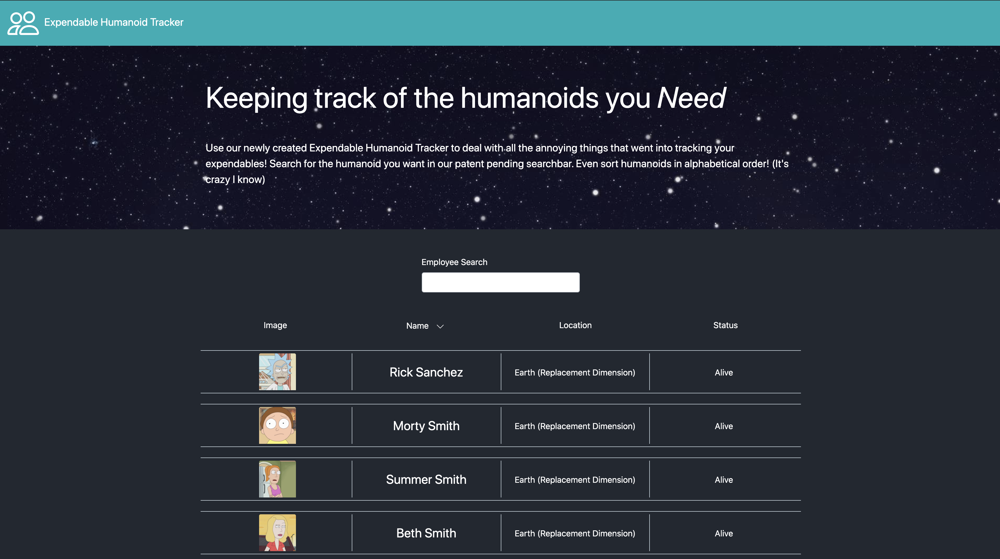

# Employee Directory

## Description

Keep track of your human employees in this Employee Tracker built with React

## Table Of Contents

- [Demo](#Demo)

- [Usage](#Usage)

- [License](#License)

- [Contributing](#Contributing)

- [Tests](#Tests)

- [Questions](#Questions)

## Demo

Check out the site here: https://macias-daniel.github.io/employee-directory/

## License

This project is licensed under: MIT

## Contributing

Make sure to leave a detailed description in your pull request

## Questions

Contact me at d.macias.apps@gmail.com if you have any questions about my project!
